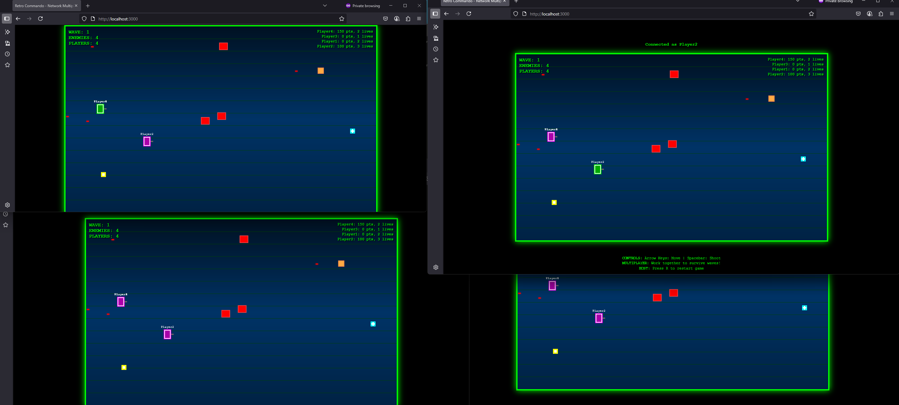

# ThePilot-Scramble-retro-game-by-AI
Game generated by AI based on:
- https://www.facebook.com/Kamikaizo/videos/1433515158005613
- https://www.facebook.com/watch/?v=9812193242174965

## Run the game Locally
```
 docker run -it --rm -p 3000:3000 --name retro-commando-server node:18-alpine /bin/sh -c "mkdir /app && wget -O /app/server.js https://raw.githubusercontent.com/MariuszFerdyn/ThePilot-Scramble-retro-game-by-AI/refs/heads/main/server.js && wget -O /app/package.json https://raw.githubusercontent.com/MariuszFerdyn/ThePilot-Scramble-retro-game-by-AI/refs/heads/main/package.json && mkdir -p /app/public && wget -O /app/public/index.html https://raw.githubusercontent.com/MariuszFerdyn/ThePilot-Scramble-retro-game-by-AI/refs/heads/main/index.html && cd /app &&  npm install && node server.js"
```
And than open browser:
http://localhost:3000/


## Deploy to Azure as autoscaled to 0 Container App

[](https://portal.azure.com/#create/Microsoft.Template/uri/https%3A%2F%2Fraw.githubusercontent.com%2FMariuszFerdyn%2FThePilot-Scramble-retro-game-by-AI%2Fmain%2FARM%2Fazure-deploy.json)


Azure Container Apps offers a free tier that provides 180,000 vCPU-seconds, 360,000 GiB-seconds, and 2 million requests per month at no cost. This free tier allows users to deploy and run containerized applications without incurring any charges for these resources as long as usage stays within the specified limits.

## How it was written

The entire project was written using AI without any hand code modification.
Step by step: https://claude.ai/public/artifacts/fb961d15-8a76-4b04-881e-3768a39ce714

# For limited time you can play game here

https://thepilot-game.delightfulocean-d4ce577a.polandcentral.azurecontainerapps.io/

## How is it looks like

### Singleplayer
[](media/GamePlay02.mp4)


### Multiplayer Screenshot


### Mulitplayer Video
[](media/GamePlay01.mp4)

